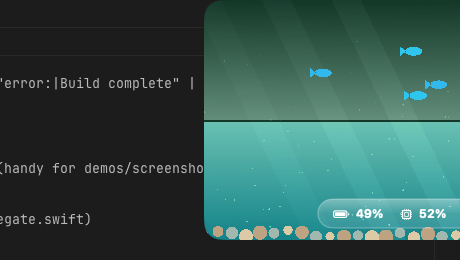

<div align="center">

# 🐠 Notchquarium

**A living Frutiger Aero aquarium that hangs from your Mac's notch — and doubles as a system monitor.**

*Your battery is the water level. Your CPU is the bubbles. Your RAM is the water clarity. Your busiest apps swim around as fish.*



</div>

---

## What is this?

The macOS notch is just a black void at the top of your screen. Notchquarium
fills it with a glossy, early-2000s **Frutiger Aero** fish tank that hangs down
from the notch — and every part of the aquarium is wired to a real system stat,
so it's a genuine monitor disguised as a desktop pet.

> *"The fish told me Chrome was eating my CPU before Activity Monitor did."*

## The vitals mapping

| What you see | What it means | Source |
|---|---|---|
| 💧 **Water level** | Battery charge | IOKit power sources |
| 🫧 **Bubble stream** | Total CPU load | Mach `host_processor_info` |
| 🌫️ **Water clarity** (clear → murky green) | Memory pressure | Mach `host_statistics64` |
| 🐟 **Fish** (size, speed, colour) | Busiest apps | `libproc` per-process CPU |
| 🏷️ **Hover a fish** | App name + its CPU % | — |

A fish grows bigger, faster and warmer-coloured the more CPU its app burns. Open
a heavy app and watch a fat orange fish dart in.

## The three states

1. **Ambient** — rests at the notch.
2. **Peek** — hover to slide a shallow tank down.
3. **Expanded** — click for the full glossy tank with the gel stat bar.

Click the 🐠 menu-bar item to show/hide the tank, or quit.

## Requirements

- macOS 14+ (a Mac with a notch is recommended, but it falls back to a
  top-centered tank on any display)
- Swift 5.9+ toolchain (Xcode 15+)

## Build & run

```bash
git clone https://github.com/IvanKuria/Notchquarium.git
cd Notchquarium
swift run Notchquarium
```

Handy environment flags for development:

| Variable | Effect |
|---|---|
| `NQ_DEBUG_VITALS=1` | Log each vitals snapshot to stderr |
| `NQ_START_EXPANDED=1` | Launch with the tank already expanded (great for demos) |

## Run the tests

```bash
swift test
```

The pure logic — vitals mapping, the snapshot→fish diff, and notch geometry —
is unit tested. Rendering is layered on top of those tested foundations.

## How it's built

| Layer | Tech |
|---|---|
| App shell / notch window | AppKit `NSPanel` (borderless, non-activating, floating) |
| Aquarium (fish, bubbles, water) | SpriteKit, all textures generated in code |
| Gel stat bar | SwiftUI (`NSHostingView` overlay) |
| Vitals | IOKit + Mach host APIs + `libproc` |

The architecture is deliberately one-directional: a `SystemVitals` actor polls
the OS and publishes an immutable `VitalsSnapshot`; the aquarium is a pure view
of the latest snapshot and never touches the OS itself.

See [`docs/superpowers/specs`](docs/superpowers/specs) for the design and
[`docs/superpowers/plans`](docs/superpowers/plans) for the build plan.

## License

MIT — see [LICENSE](LICENSE).
